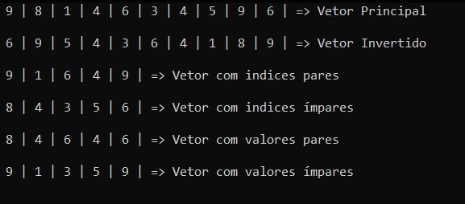

## Exercício

**Escreva um programa que leia um vetor com 30 elementos inteiros e escreva funções para fazer o que se pede (utilizar o vetor declarado globalmente)**

1. *Exibir os elementos do vetor na ordem inversa*
2. *Decompor em dois outros vetores, um contendo os elementos de índice ímpar e outro com os elementos de índice par.*
3. *Decompor em dois outros vetores, um contendo os elementos de valor ímpar e outro com os elementos de valor par.*

------

